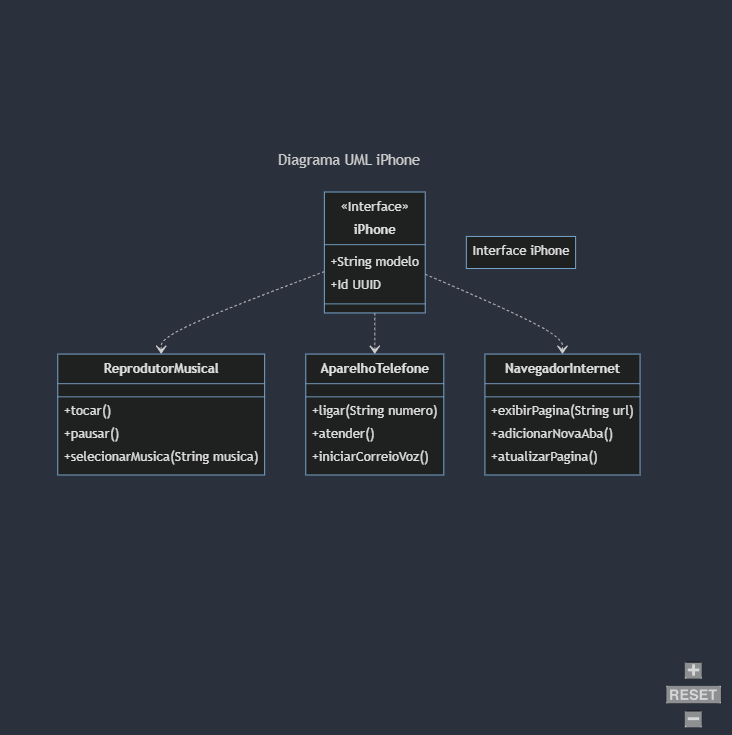

# Exemplo de Programação Orientada a Objetos iPhone

 
<a href="# 📝 Sobre"> Sobre |</a>
<a href="# 📑 UML (Diagrama de Classes)"> UML (Diagrama de Classes) |</a>
<a href="# ⚙ Tecnologias"> Tecnologias |</a>
<a href="# ✒ Autor"> Autor |</a>
<a href="# 💻 Pré-requisitos"> Pré-requisitos </a>
  
  

> [!NOTE]
> O projeto ainda está no seu início, irei atualizando aqui sempre que houver melhorias.

# 📝 Sobre

Nesse desafio, treinei conceitos da programação orientada a objetos e modelagem UML. 
Com base no vídeo de lançamento do iPhone, elaborei na ferramenta de UML Mermaid, na versão 10.9.1 A diagramação das classes e interfaces com a proposta de representar os papéis do iPhone de: Reprodutor Musical, Aparelho Telefônico e Navegador na Internet. Em seguida criei as classes e interfaces no formato de arquivos .java, é um projeto bastante básico. Mas é sempre bom certificar o conhecimento, mesmo sendo da base dos conceitos.

# 📑 UML (Diagrama de Classes)

# ⚙ Tecnologias

Java 22 (Oracle JDK 22)

# ✒ Autor

  
- Jean Carlos Macêdo Silva: 
  <a href="https://www.linkedin.com/in/jeancarlos1302/">LinkedIn</a>
 
  

# 💻 Pré-requisitos

- Lógica de programação e POO

- Conhecimentos básicos(Java)

- Computador com SO de sua preferência(Windows, Linux, Mac OS)

- IDE (Visual Studio Code, Eclipse, IntelliJ, etc.)

